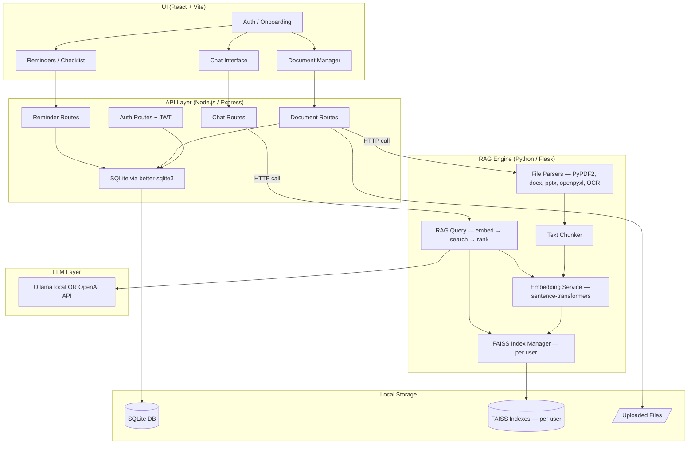
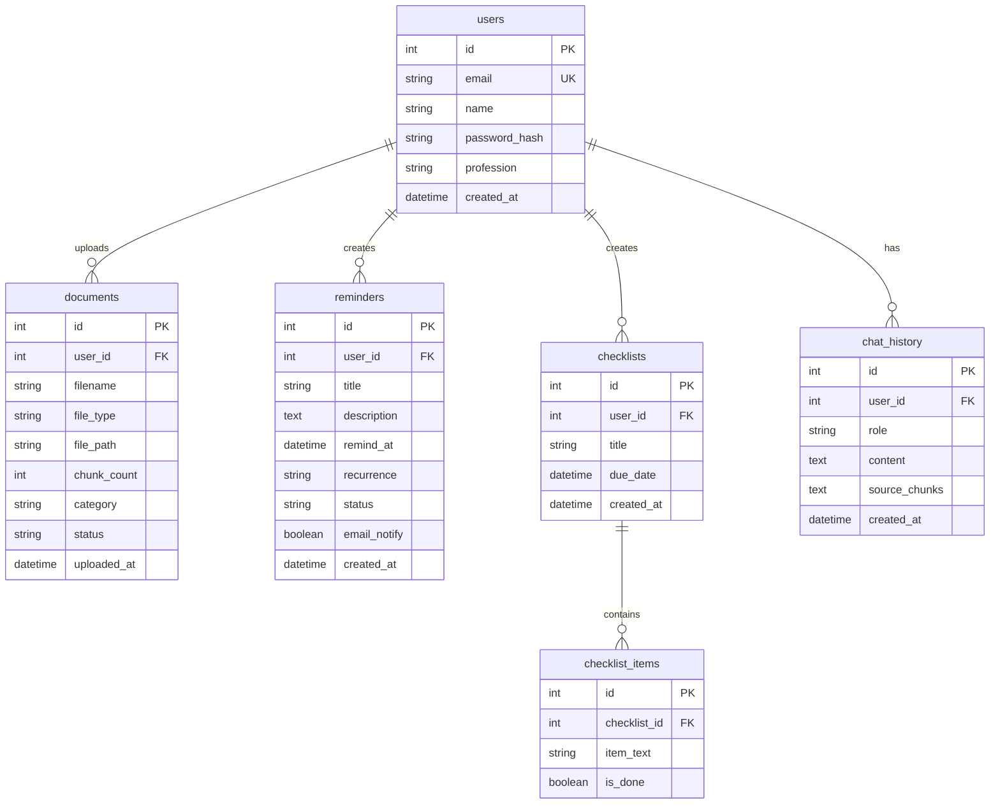

# MindSpace — Local-First RAG Personal Assistant

A profession-agnostic, RAG-powered AI assistant where users upload their documents (PDF, TXT, DOCX, XLSX, PPTX, Images), chat with their data, and get proactive reminders — all running locally.

---

## 1. High-Level Architecture



**The 3-tier flow:**
1. **React UI** → talks to Node.js via REST
2. **Node.js/Express** → handles auth, sessions, file storage, DB, business logic → calls Python for RAG operations
3. **Python (Flask)** → does ALL the AI work: parsing, chunking, embedding, FAISS indexing, RAG querying, LLM calls

---

## 2. Tech Stack

| Layer | Technology | Role |
|---|---|---|
| **Frontend** | React + Vite | UI — chat, upload, reminders |
| **Styling** | Vanilla CSS | Full control, no framework |
| **API Server** | Node.js + Express | Auth, file handling, DB, business logic |
| **Database** | SQLite (better-sqlite3) | Users, docs metadata, reminders, chat history |
| **Auth** | JWT (jsonwebtoken + bcrypt) | Stateless auth |
| **File Storage** | Local filesystem | `./storage/uploads/{userId}/` |
| **RAG Service** | Python + Flask | Internal microservice on port 5001 |
| **Document Parsing** | PyPDF2, python-docx, openpyxl, python-pptx, pytesseract | One per format |
| **Embeddings** | sentence-transformers (`all-MiniLM-L6-v2`) | Local, 384-dim vectors |
| **Vector Store** | FAISS (faiss-cpu) + numpy | Per-user indexes, local |
| **LLM** | Ollama (local) / OpenAI API | Configurable |
| **Scheduler** | node-cron | Reminder scheduling in Node |
| **Email** | nodemailer | SMTP email for reminders |

---

## 3. Communication: Node ↔ Python

Node.js calls Python's Flask API internally (both on localhost):

```
Node (port 3000)  ──HTTP──▶  Python (port 5001)
```

**Python Flask endpoints exposed to Node:**

| Endpoint | Method | Purpose |
|---|---|---|
| `POST /ingest` | POST | Parse file + chunk + embed + add to FAISS |
| `POST /query` | POST | Embed question + FAISS search + LLM answer |
| `DELETE /documents/{doc_id}` | DELETE | Remove doc vectors from FAISS |
| `GET /health` | GET | Health check |

**Example flow — Document Upload:**
```
User uploads PDF via UI
  → React sends multipart POST to Node /api/documents/upload
    → Node saves file to disk, creates DB record
    → Node calls Python POST /ingest { userId, filePath, docId, fileType }
      → Python parses → chunks → embeds → stores in FAISS
      → Returns { chunkCount, status }
    → Node updates DB with chunk count
    → Returns success to React
```

**Example flow — Chat Query:**
```
User asks "What is the leave policy?"
  → React sends POST to Node /api/chat
    → Node calls Python POST /query { userId, question, chatHistory }
      → Python embeds question → FAISS top-5 search → builds prompt → calls LLM
      → Returns { answer, sourceChunks }
    → Node saves to chat_history table
    → Returns answer to React
```

---

## 4. Data Model (SQLite — managed by Node)



> [!NOTE]
> Chunk text and FAISS vector mappings are managed **entirely by Python** (stored in pickle files alongside FAISS indexes). Node only knows document-level metadata.

---

## 5. Project Structure

```
mindspace/
├── API/                              # Node.js Express server
│   ├── package.json
│   ├── server.js                     # Express app entry point
│   ├── config.js                     # Env config (ports, JWT secret, etc.)
│   ├── database.js                   # SQLite setup + schema init
│   ├── middleware/
│   │   └── auth.js                   # JWT verification middleware
│   ├── routes/
│   │   ├── auth.routes.js            # Register, login
│   │   ├── documents.routes.js       # Upload, list, delete docs
│   │   ├── chat.routes.js            # Chat with RAG
│   │   ├── reminders.routes.js       # CRUD reminders + checklists
│   │   └── health.routes.js          # Health check
│   ├── services/
│   │   ├── rag-bridge.js             # HTTP client to call Python RAG service
│   │   ├── scheduler.js              # node-cron for reminders
│   │   └── email.service.js          # nodemailer SMTP
│   └── storage/
│       └── uploads/                  # Uploaded files (per user subdirs)
│
├── RAG/                              # Python Flask RAG microservice
│   ├── requirements.txt
│   ├── app.py                        # Flask app entry point
│   ├── config.py                     # Settings (model names, LLM config)
│   ├── routes/
│   │   ├── ingest.py                 # /ingest endpoint
│   │   └── query.py                  # /query endpoint
│   ├── services/
│   │   ├── parser.py                 # Dispatcher — routes to correct parser
│   │   ├── chunker.py                # Text chunking with overlap
│   │   ├── embeddings.py             # sentence-transformers wrapper
│   │   ├── vector_store.py           # FAISS index manager (per-user)
│   │   ├── rag_engine.py             # Full RAG pipeline
│   │   └── llm.py                    # LLM abstraction (Ollama / OpenAI)
│   ├── parsers/
│   │   ├── pdf_parser.py             # PyPDF2
│   │   ├── docx_parser.py            # python-docx
│   │   ├── xlsx_parser.py            # openpyxl
│   │   ├── pptx_parser.py            # python-pptx
│   │   ├── txt_parser.py             # Plain text
│   │   └── image_parser.py           # pytesseract OCR
│   └── storage/
│       ├── faiss_indexes/            # FAISS index files ({user_id}.index)
│       └── chunk_maps/              # Chunk text mappings ({user_id}.pkl)
│
└── UI/                               # React + Vite frontend
    ├── index.html
    ├── vite.config.js
    ├── package.json
    ├── public/
    └── src/
        ├── main.jsx
        ├── App.jsx
        ├── index.css
        ├── api/
        │   └── client.js             # Axios wrapper → Node API
        ├── pages/
        │   ├── Login.jsx
        │   ├── Register.jsx
        │   ├── Dashboard.jsx          # Main chat + sidebar layout
        │   ├── Documents.jsx          # Upload & manage docs
        │   └── Reminders.jsx          # Reminders & checklists
        ├── components/
        │   ├── ChatWindow.jsx
        │   ├── MessageBubble.jsx
        │   ├── FileUploader.jsx
        │   ├── DocumentList.jsx
        │   ├── ReminderCard.jsx
        │   └── Sidebar.jsx
        └── hooks/
            └── useAuth.js
```

---

## 6. Key Design Decisions

### 6.1 Why Node + Python (not just one)?

| Concern | Node.js | Python |
|---|---|---|
| Web API, auth, sessions | ✅ Fast, well-suited | ❌ Overkill |
| File upload handling | ✅ multer, streams | ❌ |
| SQLite, business logic | ✅ better-sqlite3 is sync & fast | ❌ |
| Document parsing | ❌ Poor library ecosystem | ✅ PyPDF2, docx, etc. |
| ML embeddings | ❌ No sentence-transformers | ✅ Native PyTorch |
| FAISS | ❌ No bindings | ✅ faiss-cpu, numpy |
| LLM calls | Possible | ✅ Better ecosystem |

**Node handles what Node does best. Python handles what Python does best.**

### 6.2 Per-User FAISS Indexes

> [!IMPORTANT]
> Each user gets their own FAISS index file (`RAG/storage/faiss_indexes/{user_id}.index`) + chunk mapping (`RAG/storage/chunk_maps/{user_id}.pkl`). This provides:
> - **Data isolation** — complete tenant separation
> - **Easy cleanup** — delete user = delete their files
> - **Incremental updates** — add vectors without rebuilding

### 6.3 Chunking Strategy

- **Chunk size**: ~500 tokens (~2000 characters)
- **Overlap**: 100 tokens (~400 characters)
- **Excel**: Each sheet → rows with headers prepended as context
- **PPT**: Each slide = one chunk
- **Images**: OCR text treated same as plain text

### 6.4 LLM Choice (Configurable)

> [!NOTE]
> Two modes supported, toggled in `RAG/config.py`:
> 1. **Ollama (default)** — Fully local, `llama3.2` or `mistral`, needs ~8GB RAM
> 2. **OpenAI API** — Higher quality, needs API key

---

## 7. User Review Required

> [!IMPORTANT]
> **LLM Provider**: Default to **Ollama** (fully local) or **OpenAI API** for development? I'll wire both — just need to know the default.

> [!IMPORTANT]
> **Image OCR**: `pytesseract` needs `brew install tesseract` on macOS. Include image support, or skip for v1?

> [!IMPORTANT]
> **Email for Reminders**: Wire up `nodemailer` in Phase 1 (needs SMTP creds), or defer and do in-app notifications only first?

> [!IMPORTANT]
> **New `RAG/` directory**: I see you have `API/` and `UI/` already. I'm proposing a third top-level directory `RAG/` for the Python service. This keeps the Node and Python codebases cleanly separated. Good with this?

---

## 8. Phased Build Plan

### Phase 1 — Backend Foundation (Node.js)
Stand up Express, SQLite, auth, file upload.

| # | Task | Files |
|---|---|---|
| 1 | Express app scaffold + config | `API/server.js`, `API/config.js`, `API/package.json` |
| 2 | SQLite database + schema | `API/database.js` |
| 3 | Auth routes (register/login/JWT) | `API/routes/auth.routes.js`, `API/middleware/auth.js` |
| 4 | Document upload route (multer) | `API/routes/documents.routes.js` |
| 5 | RAG bridge service (HTTP to Python) | `API/services/rag-bridge.js` |

### Phase 2 — Python RAG Engine
The AI brain — parsing, chunking, embedding, FAISS, querying.

| # | Task | Files |
|---|---|---|
| 6 | Flask app scaffold | `RAG/app.py`, `RAG/config.py`, `RAG/requirements.txt` |
| 7 | All 6 document parsers | `RAG/parsers/*.py` |
| 8 | Text chunker | `RAG/services/chunker.py` |
| 9 | Embedding service (sentence-transformers) | `RAG/services/embeddings.py` |
| 10 | FAISS index manager | `RAG/services/vector_store.py` |
| 11 | Ingest endpoint (parse → chunk → embed → store) | `RAG/routes/ingest.py` |
| 12 | LLM abstraction (Ollama + OpenAI) | `RAG/services/llm.py` |
| 13 | RAG query engine + endpoint | `RAG/services/rag_engine.py`, `RAG/routes/query.py` |

### Phase 3 — Chat & Reminders (Node.js)
Wire up chat route through to Python, add reminder system.

| # | Task | Files |
|---|---|---|
| 14 | Chat route (proxies to Python /query) | `API/routes/chat.routes.js` |
| 15 | Reminder/checklist CRUD | `API/routes/reminders.routes.js` |
| 16 | node-cron scheduler | `API/services/scheduler.js` |
| 17 | Email service (nodemailer) | `API/services/email.service.js` |

### Phase 4 — Frontend (React)
Full UI — auth, chat, documents, reminders.

| # | Task | Files |
|---|---|---|
| 18 | Vite + React scaffold | `UI/*` |
| 19 | Auth pages | `UI/src/pages/Login.jsx`, `Register.jsx` |
| 20 | Dashboard + chat interface | `UI/src/pages/Dashboard.jsx`, components |
| 21 | Document upload & management | `UI/src/pages/Documents.jsx` |
| 22 | Reminders & checklists | `UI/src/pages/Reminders.jsx` |

### Phase 5 — Polish & Integration
End-to-end testing, error handling, UX refinements.

---

## 9. How to Run (Dev)

```bash
# Terminal 1 — Python RAG service
cd RAG
pip install -r requirements.txt
python app.py                          # Runs on http://localhost:5001

# Terminal 2 — Node.js API
cd API
npm install
node server.js                         # Runs on http://localhost:3000

# Terminal 3 — React UI
cd UI
npm install
npm run dev                            # Runs on http://localhost:5173
```

---

## 10. Verification Plan

### Automated Tests
```bash
# Python parser tests
cd RAG && python -m pytest tests/ -v

# Node API tests
cd API && npm test
```

### Manual Verification
1. Upload PDF via UI → verify it appears in documents list → chat about its content
2. Upload XLSX → ask about specific cell values
3. Two users upload different data → verify isolation
4. Set a reminder via chat → verify it fires
5. Add data on the fly → verify subsequent queries include new data

### Browser Testing
- Full flow: Register → Upload 3 docs → Chat → Set reminder → Verify accuracy
